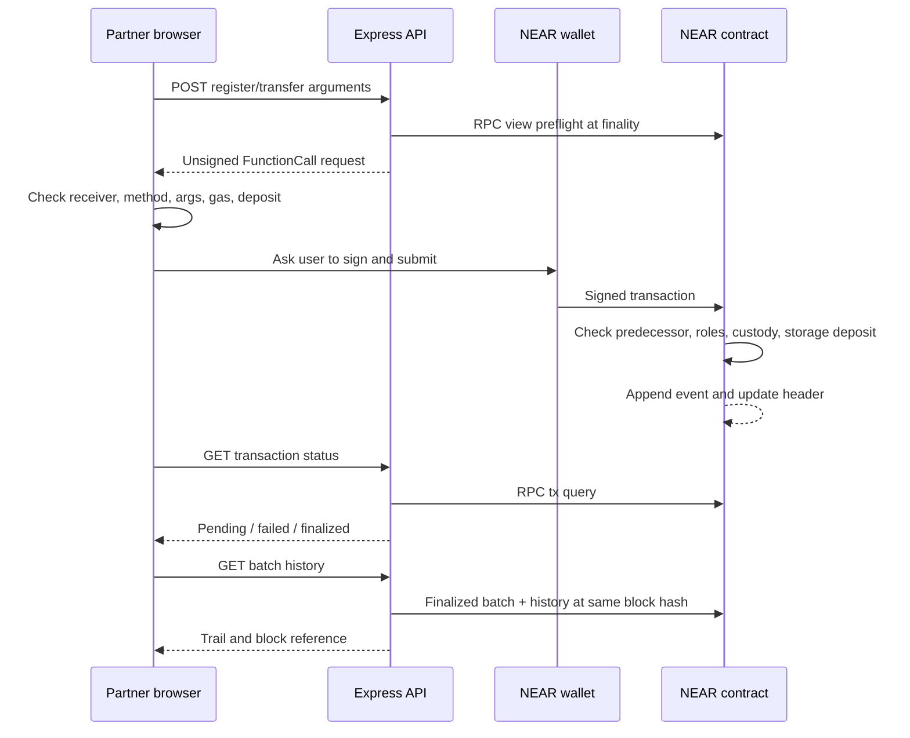

# Architecture and assumptions

## Authority and custody

`owner_id` can assign Producer, Distributor, Retailer, or Consumer. An unknown account is Consumer. Consumer verification is public and read-only. The owner does not automatically have a producer role. Privilege checks use `predecessor_account_id`, never a client-supplied actor or `signer_account_id` forwarded through another contract.

| Current role/status | Allowed receiver role | Resulting status |
| --- | --- | --- |
| Producer / Registered | Distributor | InDistribution |
| Distributor / InDistribution | Retailer | AtRetailer |
| Retailer / AtRetailer | None | Terminal |

Only the recorded custodian can act. The custodian's current role must still match the role recorded on the batch. Revoking or changing that role freezes its active batches until the original role is restored. This is deliberate; administrator reassignment, rescue, and lost-key recovery need a separate audited policy. Recipient accounts must be registered by the owner, who must verify their existence and organizational identity during onboarding.

Two concurrent handoffs cannot both succeed: execution is serialized, and the second fails its custodian check. API preflight is advisory and may become stale; on-chain checks are repeated at execution. Storage insufficiency or any panic reverts the transaction's state changes on NEAR.

## State and cost

- `LookupMap<AccountId, Role>` for roles.
- `LookupMap<String, Batch>` for current custody and immutable product metadata.
- `LookupMap<(batch_id, index), CustodyEvent>` for append-only history.

The explicit `legacy` near-sdk feature enables eagerly written LookupMaps. This is intentional so `env::storage_usage()` sees collection changes before charging the caller. If migrating to `near_sdk::store`, flush modified collections before measuring storage.

Header lookup is O(1); a history page is O(limit), capped at 100 entries. The current linear model has exactly one registration and at most two transfers. The indexed history layout permits richer workflows without rewriting a growing vector. A list-all-batches endpoint is intentionally absent: use an indexer for account dashboards, search, analytics, or global enumeration. Do not add an unbounded loop over all on-chain records.

The API attaches 0.05 NEAR plus 100 Tgas per state-changing call as a conservative starting allowance, not a measured fee quote. The contract charges actual incremental storage bytes at the runtime byte cost, refunds excess, and rejects insufficient deposits. Gas is separate. Refunds are asynchronous; the API exposes failed receipt IDs even if the main action succeeded. Measure actual costs before choosing production limits. Root-state initialization is funded by the deployed contract account. Role changes retain role keys rather than reclaiming storage.

Timestamps originate from NEAR block time and serialize as decimal nanosecond strings. The frontend converts with BigInt before formatting local time. They show record inclusion time, not independently authenticated real-world pickup time.

Events use `EVENT_JSON:` followed by `{standard:"mixit_trace",version:"1.0.0",event,data:[...]}`. This is a custom application schema using the NEP-297 envelope, not a standardized supply-chain event protocol. An indexer should deduplicate by receipt ID plus log index and process finalized successful execution only.

## Metadata and privacy

Optional metadata URI and SHA-256 must be supplied together. Store the hash of the exact uploaded bytes (not a reserialized JSON object). Use pinned IPFS content or durable HTTPS storage with independent backups. URI/hash cannot be changed after registration. Keep invoices, producer descriptions, certifications, or photos off-chain; avoid personal data. Hash commitments protect integrity only when consumers actually recompute and compare the hash. They do not guarantee availability or factual correctness. This scaffold displays metadata links and hashes but does not claim to validate external content.

## Threat model and remaining product decisions

| Threat | Existing control | Remaining limitation / extension |
| --- | --- | --- |
| Role spoofing / client tampering | Contract predecessor and role checks | Admin must verify organizations |
| Unauthorized transfer | Current custodian + next-role checks | Compromised keys can submit false declarations |
| Duplicate batch IDs | Caller prefix + uniqueness assertion | A producer can register the same physical lot under multiple IDs |
| History alteration | No public mutation/deletion methods | Deployment full-access keys can upgrade code; disclose governance |
| Forged QR label | Public trail lookup | QR can be copied; add serials/tamper seals and duplicate-scan detection |
| Fake receipt | Recorded sender declaration | Add recipient acceptance / disputes |
| RPC/API spoofing | Finalized reads, block references, fixed frontend transaction parameters | UI trusts server; add independent node/proof verification |
| State growth abuse | Roles, bounded fields, caller-paid storage | Admin onboarding and rate policy still matter |
| API resource abuse | Body limits, validation, rate limits, bounded queries | Add shared rate storage, timeouts and monitoring for production |
| Server key theft | Backend has no NEAR keys | Deployment/admin keys need separate secure custody |

CORS is a browser policy, not authentication. Unsigned POST preparation is intentionally public and cannot mutate the chain by itself. No database is needed for the core proof-of-concept. Add PostgreSQL as an indexed cache, never as the authoritative custody record, when search and statistics are required.

Mainnet readiness requires governance/key recovery, upgrade and migration strategy, contract audit, dependency review, reliable RPC/indexer, recipient attestation policy, and measured costs. This scaffold has no pause switch, owner rotation, or migration method yet; adding them changes the trust model and should be justified in the dissertation.
